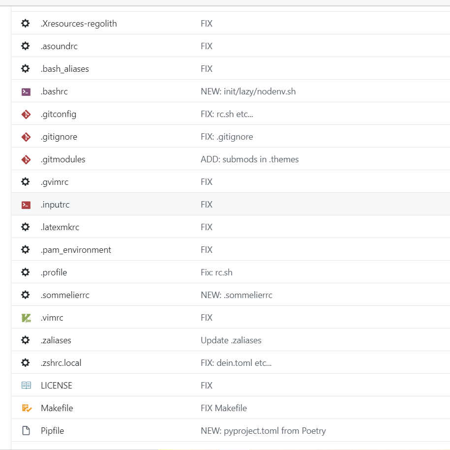

# dotfiles

[](https://github.com/borley1211/dotfiles/issues)
[](https://github.com/borley1211/dotfiles/network/members)
[](https://github.com/borley1211/dotfiles/stargazers)
[](https://github.com/borley1211/dotfiles/)

# Tags
`zsh` `bash` `dotfiles`

# Short Description
The configuration files repository.

This repo is inspired by [this project](https://github.com/b4b4r07/dotfiles).

# Advantages
(I don't know)

# Installation
### on Unix
```console:
# this URL is redirected to https://raw.githubusercontent.com/borley1211/dotfiles/master/etc/install .
$ curl -L https://git.io/dot.borley1211 | bash
```

### on Windows
**Please run it in *WSL*.**
```console:
# this URL is redirected to https://raw.githubusercontent.com/borley1211/dotfiles/master/etc/install-win .
$ curl -L https://git.io/dot.borley1211.win | bash
```

# Deployment
```console:
$ cd ${DOTPATH}
$ make deploy
```

# Minimal Example



# Contributors
- [borley1211](https://github.com/borley1211)
- [renovate-bot](https://github.com/renovate-bot)

